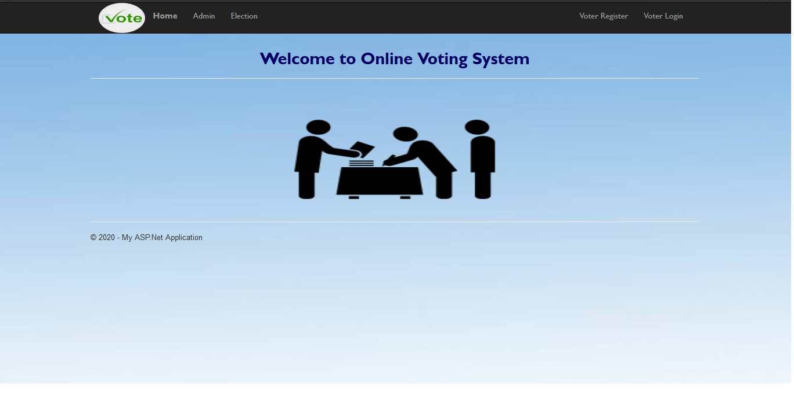
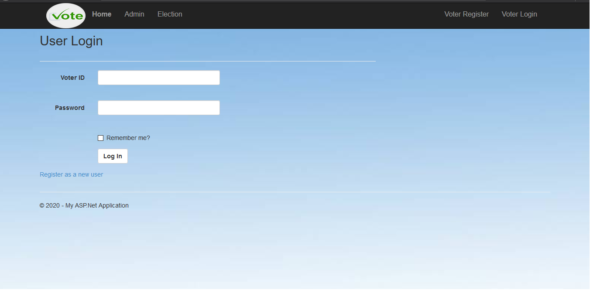
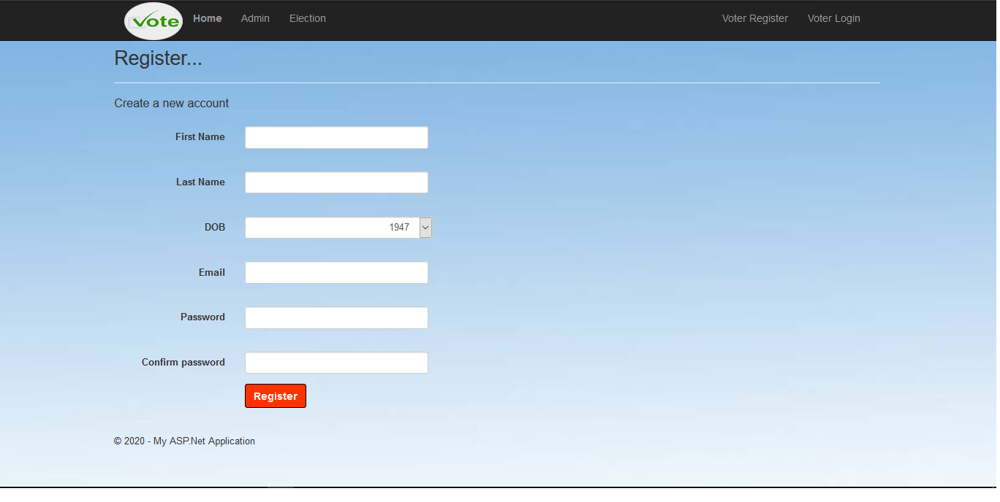
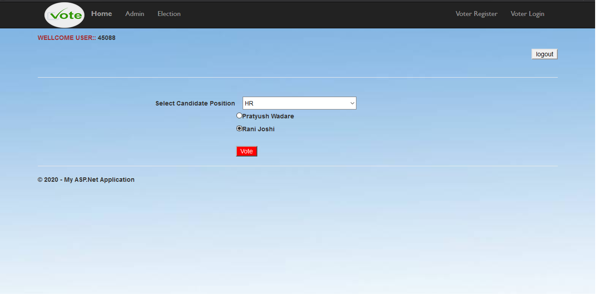
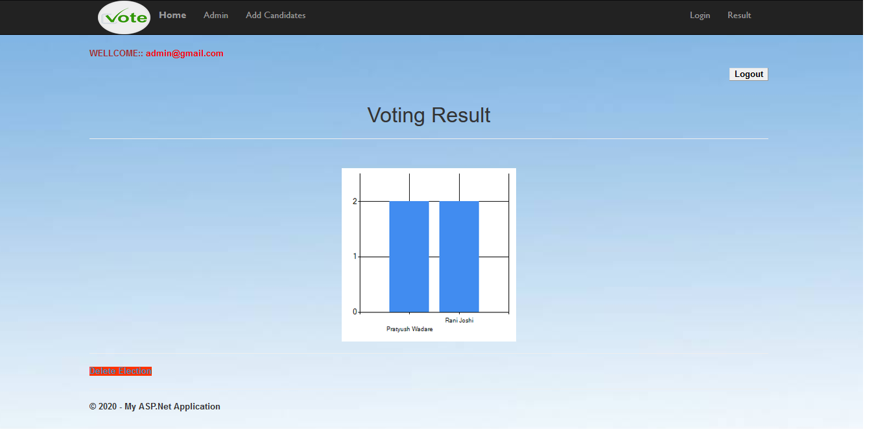

# Online-Voting-System
An Online Voting System project using ASP.NET and SQL Database.

•	Installation 
<ul>
  <li>	Prerequisites
      <ol>
        <li>Microsoft Visual Studio 2015</li>
        <li>Micosoft SQL Server</li>
        <li>SQL Configuration Manager</li>
        <li>Web Browse</li>
      <ol>
  </li>
  </ul>
  <ul>
<li>Using Microsoft Visual Studio 2015
    <ol>
      <li> Create a new Project Website in Visual Studio  </li>
      <li>Fork this repo  </li>
      <li>Copy all the files in this repo to website's folder  </li>
      <li> Configure Database on the machine accordingly  </li>
      <li> Run the website</li>
    </ol>
   </li>
</ul><ul>
<li>	Technologies Used
    <ul>
      <li>Visual Studio 2015</li>
      <li>HTML,CSS and C#</li>
      <li>SQL</li>
    </ul>

</li>
</ul>

•	Main files
<ul>
	<li>Home.aspx</li>
  <li> Admin</li>
   <ul>
      <li>AddCandidates.aspx</li>
      <li>admin.aspx</li>
      <li>AdminLogin.aspx</li>
      <li>Result.aspx</li>
    </ul>
	<li>User</li>
    <ul>
      <li>Election.aspx</li>
      <li>Login.aspx (User Login)</li>
      <li>Register.aspx</li>
    </ul>
</ul>

•	Snapshot of a project

Candidate Registration Screen

Voter Login Screen

Voter Registration Screen

Election

Result Screen

